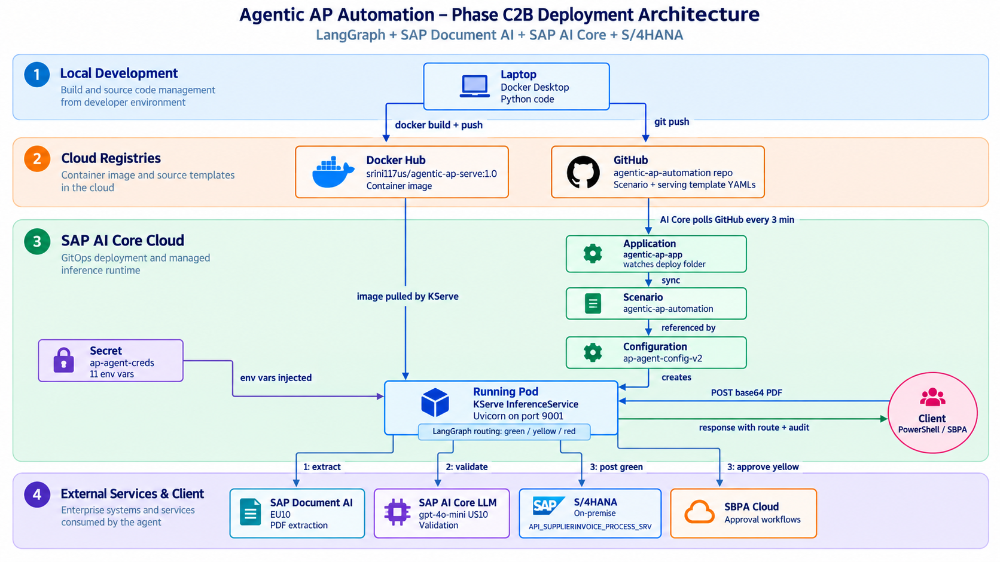
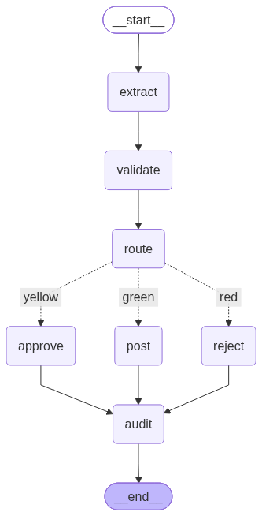

# Agentic AP Automation

LangGraph based agent for supplier invoice processing on SAP BTP.

Deployed as KServe InferenceService in SAP AI Core.

## Deployment Architecture

## Workflow

7 nodes with conditional routing:
- **extract**: SAP Document AI (headers + line items)
- **validate**: LLM anomaly detection + confidence score
- **route**: green (>=0.80) | yellow (0.51-0.80) | red (<0.51)
- **post**: S/4HANA OData (mocked; production via SBPA HTTP Action)
- **approve**: SBPA task for human review
- **reject**: AP team notification
- **audit**: structured log for all paths

## Stack

- **SAP Document AI** (EU10): PDF extraction, 34 formats supported
- **SAP AI Core** (US10): LLM validation via gpt-4o-mini deployment
- **LangGraph**: agent orchestration and state management
- **FastAPI**: HTTP server on port 9001
- **SBPA**: production workflow for approval + posting (Phase C3)
- **S/4HANA On-Premise**: API_SUPPLIERINVOICE_PROCESS_SRV

## Deployment (SAP AI Core)

- Container image: docker.io/srini117us/agentic-ap-serve:1.0
- Scenario: agentic-ap-automation
- Executable: ap-agent-serve
- Configuration: ap-agent-config-v2
- Secret: ap-agent-creds (11 env vars injected via Kubernetes secretKeyRef)
- Inference endpoint: /v2/inference/deployments/{id}/v1/invoke

## Run Locally

python invoice_agent.py <path_to_invoice.pdf>

## Generate Workflow Diagram

python invoice_agent.py --graph-png

## Environment

Requires .env with credentials for:
- SAP Document AI (EU10)
- SAP AI Core (US10)
- S/4HANA (on premise)
- SBPA (optional, for Phase C3)

Sample template in code/.env.example
